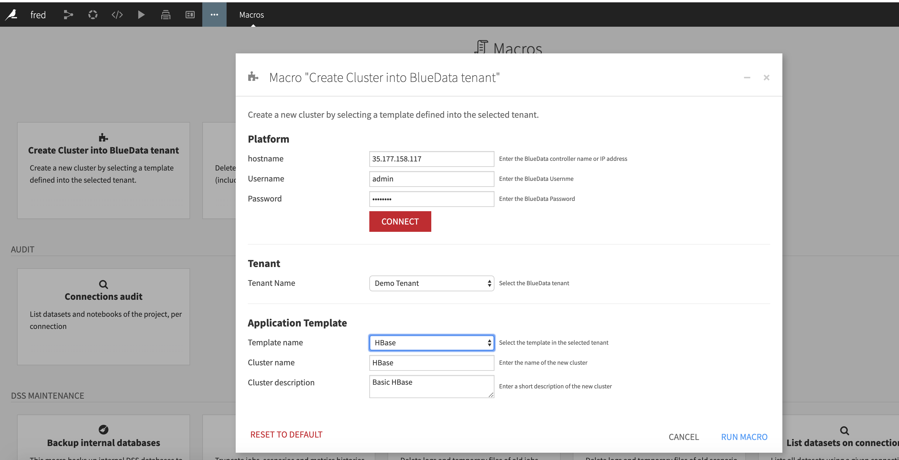

// List installed JDK

/usr/libexec/java_home -V

// Select the right JDK if necessary (if multi JDK installed )

export JAVA_HOME=`/usr/libexec/java_home -v  1.8.0_222`

// on Mac to launch Dataiku application

open -a DataScienceStudio

// CallPythonDo requires project key to run properly. this information not available into cluster plugin (not associated
// with project. So, I have to create a macro for using this capability (other possibility is to use a webapps)

